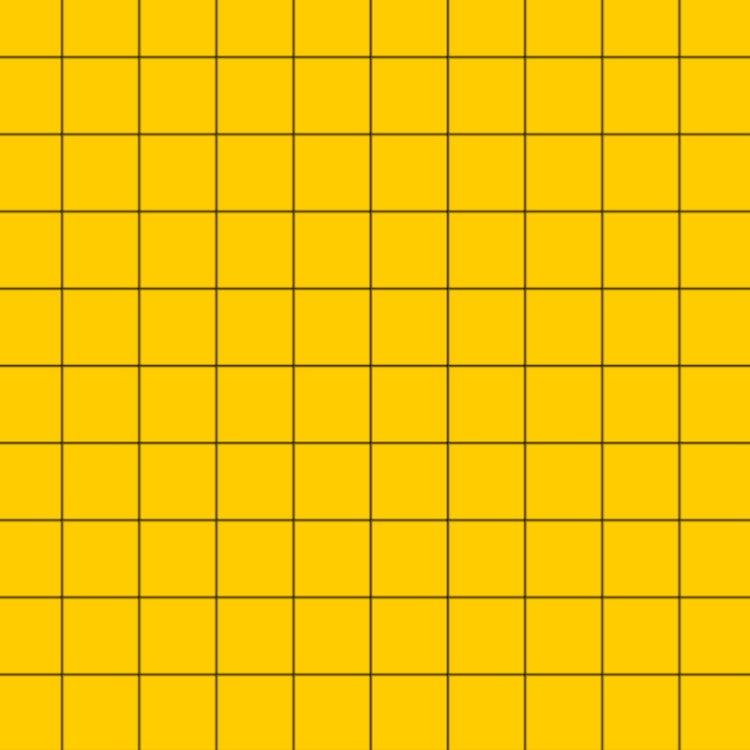
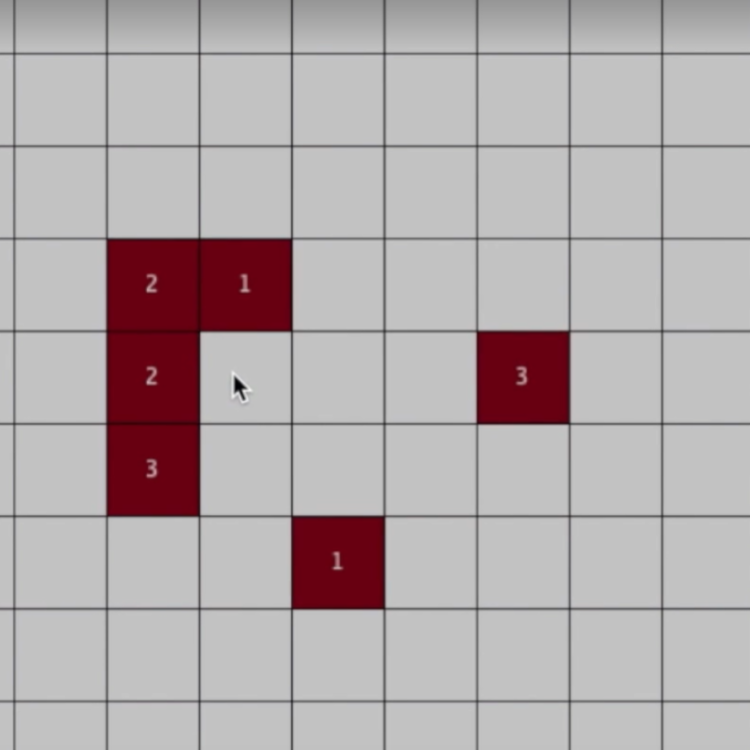

# Radioactive Minesweeper

<h2>Summary</h2>

<i>his is my own version of the traditional Minesweeper game. It was a personal project and I implemented it in Processing programming language. I wanted it to be a bit unique so it has the theme and appearance of radioactive bombs and the player needs to save the world from them.

This project started after I was challenged by a friend to each one of us code a Minesweeper game in different coding language and implemented the game logic ourselves. I had a great time to explore how all the game rules and logic works in the classic Minesweeper and to figure out how I should implement it. For the game logic, I had great use of the algorithm explanation at the <a href="http://codebuild.blogspot.com/2015/01/algorithms-explained-minesweeper-game.html">Codebuild website</a>.</i>

<h2>Technical Walkthrough</h2>

The first thing I started with was to create the board. The board is represented by a 2D matrix of colors where the color of each item in the matrix is depending on the state of that particular "cell". The number of mines is a predetermined number and I setup the board by generating a random index for each mine and place the mine there (if no mine is placed there before) and if a mine is placed I store true in an array that represents the "bombstate" for all the cells.

Each cell also needs to have a "count" on how many mines that particular cell is neighbour to. In the initialization I go through the whole board and for each cell it updates the count for each neighbouring cell. When this is done the numbers are stored in an array and the board is drawn. Another array is used to store if a cell is opened or not, in the beginning all is closed.

 

<i>Setting up of a grid with square cells. In early development I used grey colors and red to mark the mines. Each cell contains info about mines, flagged, opened and number of neighbouring mines.</i>

Each time that the player left clicks on a cell that cell is being marked as opened. If the cell contains a mine, the player loses, otherwise keep playing. If a cell is opened that has 0 mines as neighbours I use an auxiliary function that check the surroundings around that cell, opens them up and check for more zeros. It is recursive so if a neighbouring cell also are 0, that cells surroundings are opened as well.

When the player right clicks on a cell, that cell is being marked as flagged and the player believes that it contains a mine. That cell is still marked as closed but if the player later on left clicks on it, it will be opened. The player can't close a cell once it is opened.

If all cells that contains a mine has being marked as flagged and all the other cells has being marked as opened, the player wins.

 

<i>Adding of the function that opens up neighbouring cells if a mine has 0 neighbouring mines.</i>

This was a fun project that I learned a lot from, even though I would like to improve it further by optimizing the data structures used (only use 2D arrays to remove the convertion step with the index for example) and to divide the steps into more functions to keep the setup and draw functions more clean. I see that I would have liked to use a more object-oriented approach, and it might be something that I do in the future, to remake it this way.

